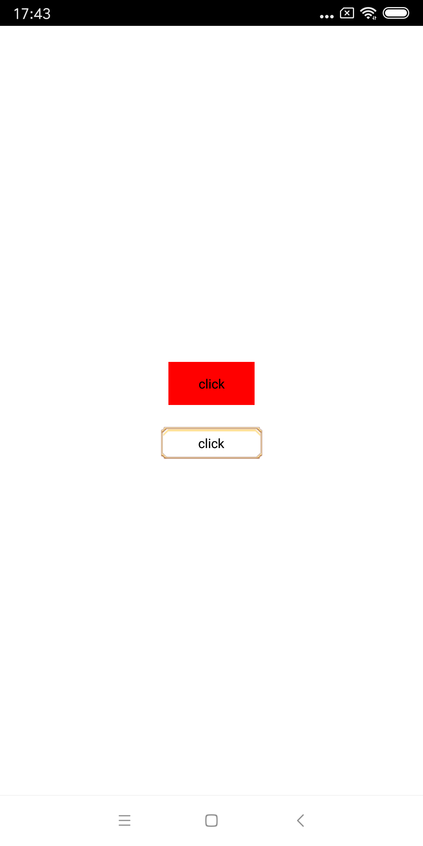

# react-native-imagebutton

## Getting started

`$ npm install react-native-image-button-text --save`

## Usage
```javascript
import {Imagebutton} from 'react-native-image-button-text';
```
#### props
-   width: PropTypes.number.isRequired, //the component size
-   height: PropTypes.number.isRequired,
-   text: PropTypes.string.isRequired, //show text on the componet
-   backgroundColor: PropTypes.string, //button color default transparent
-   activeOpacity: PropTypes.number,  //default 0.3 
-   fontSize: PropTypes.number,
-   textColor: PropTypes.string,
-   onPress: PropTypes.func,
-   paddingTop: PropTypes.number, //text marging top
-   paddingLeft: PropTypes.number, //text marging left
-   paddingRight: PropTypes.number, //text marging right
-   paddingBottom: PropTypes.number,//text marging bottom
-   textAlignVertical: PropTypes.oneOf(['flex-start', 'center', 'flex-end']),//text vertical position,default center
-   textAlignHorizontal: PropTypes.oneOf(['flex-start', 'center', 'flex-end']) //text horizontal position,default center



### like this!
```javascript
<ImageButton width={80} height={40} text="click me" backgroundColor="red"/>
<ImageButton style={{marginTop: 20}} 
    width={94.5} 
    height={30.5} 
    text="click me" 
    source={require('./solo/images/btn_ok.png')}/>
```
#### use the ImageButton Component
```javascript

_share=()=>{
    
};

<ImageButton style={styles.btn}
        width={250}
        height={64}
        fontSize={20}
        textColor="#ffe490"
        paddingTop={4}
        textAlignHorizontal="flex-start"
        onPress={this._share.bind(this)}
        source={require('../images/join_reward_normal.png')}
        text="share"
      />
```


